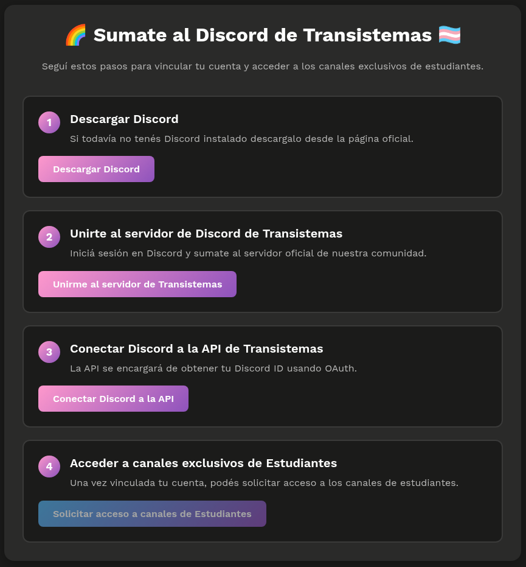
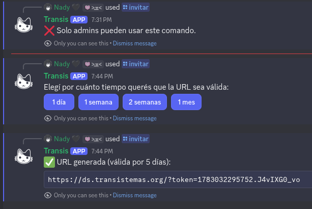

# 🔗 ds-invite

Servicio en **Cloudflare Workers** que genera URLs temporales para que estudiantes puedan acceder a los canales exclusivos del servidor de Discord de Transistemas. Incluye autenticación OAuth2, sesiones firmadas y validación segura de tokens con tiempo de expiración.

</img>
</img>

 

## 🚀 Funcionalidad principal

### Autenticación OAuth2 con Discord

El Worker conecta la cuenta de cada persona mediante Discord OAuth2 para obtener su Discord ID de forma segura.

### Generación de hashes temporales

`GET /hash?ttl=<segundos>` devuelve un token firmado que expira luego de un tiempo configurable; por ejemplo:

`/hash?ttl=86400` → 24 horas
Solo usuaries con ese token pueden solicitar el rol de estudiante.

### Asignación del rol de “Estudiante”

Si el token es válido y la sesión está autenticada, el Worker usa la API de Discord para asignar automáticamente el rol.

 

## 🤖 Comando `/invitar`

Permite generar la URL temporal desde Discord usando el <a href="https://github.com/Transistemas-ac/bot">bot de Transistemas</a>.

- `/invitar dias:<n>` → genera directamente una invitación válida n días.

- Sin argumentos muestra botones interactivos:  
  `1 día`, `1 semana`, `2 semanas` y `1 mes`, cada uno generando automáticamente la invitación correspondiente.

 

## 📁 Estructura del proyecto

ds-invite/  
├── public/  
│ └── `index.html`  
│ └── `styles.css`  
│ └── `scripts.js`  
│ └── `favicon.png`  
│ └── `ui.png`  
├── src/  
│ ├── controllers/  
│ │ ├── `generateToken.js`  
│ │ ├── `handleDiscordCallback.js`  
│ │ ├── `handlePutUser.js`  
│ │ ├── `handleRequestStudentRole.js`  
│ │ └── `redirectToDiscordOAuth.js`  
│ ├── utils/  
│ │ ├── `base64UrlDecode.js`  
│ │ ├── `base64UrlEncode.js`  
│ │ ├── `createSessionCookie.js`  
│ │ ├── `getSessionDiscordId.js`  
│ │ ├── `hash.js`  
│ │ ├── `parseCookies.js`  
│ │ ├── `signDiscordId.js`  
│ │ └── `verifyDiscordId.js`  
│ └── `worker.js`  
├── `wrangler.toml`  
└── `README.md`

 

## ⚙️ Endpoints del Worker

- `GET /` → sirve el index.html
- `GET /login/discord` → inicia OAuth2
- `GET /auth/discord/callback` → procesa OAuth y crea sesión
- `PUT /user` → devuelve el discordId si la sesión es válida
- `GET /hash?ttl=<segundos>` → genera token temporal
- `POST /?token=<hash>` → asigna rol si token y sesión son válidos

 

## 🛡️ Seguridad

- Tokens firmados mediante HMAC-SHA256
- Expiración estricta basada en timestamp
- Cookies HttpOnly, Secure y SameSite=None
- Ningún secreto se versiona en Git
- Cloudflare Workers y Discord Bot correctamente aislados
- Se configuran como secrets:
  - `npx wrangler secret put CLIENT_ID`
  - `npx wrangler secret put CLIENT_SECRET`
  - `npx wrangler secret put BOT_TOKEN`
  - `npx wrangler secret put SECRET`

 

## 🧪 Flujo completo

1. Admin ejecuta el comando `/invitar` del bot de Discord para generar una URL y elige la cantidad de días que debe estar activa.
2. El bot responde con una URL temporal para compartir con les estudiantes.
3. Les estudiantes ingresan a `ds.transistemas.org/?token=...`
4. Conectan su Discord mediante OAuth.
5. El Worker valida token + sesión.
6. Se asigna automáticamente el rol de `Estudiante`.
7. Cuando el tiempo asignado pasa el token se vuelve inválido para asignar rol de `Estudiante`.

 

## 📝 Licencia

Este proyecto está publicado bajo la licencia MIT.

 

---

_🌈 Creado con orgullo por el Equipo de Desarrollo de Transistemas ❤_
